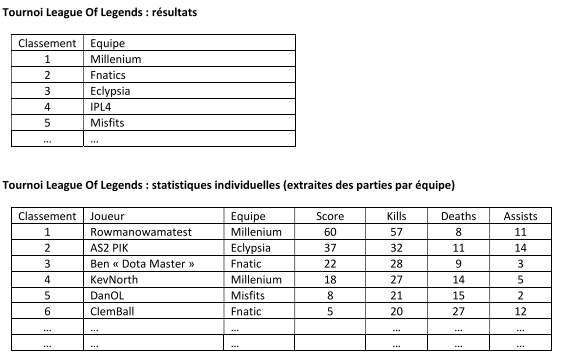
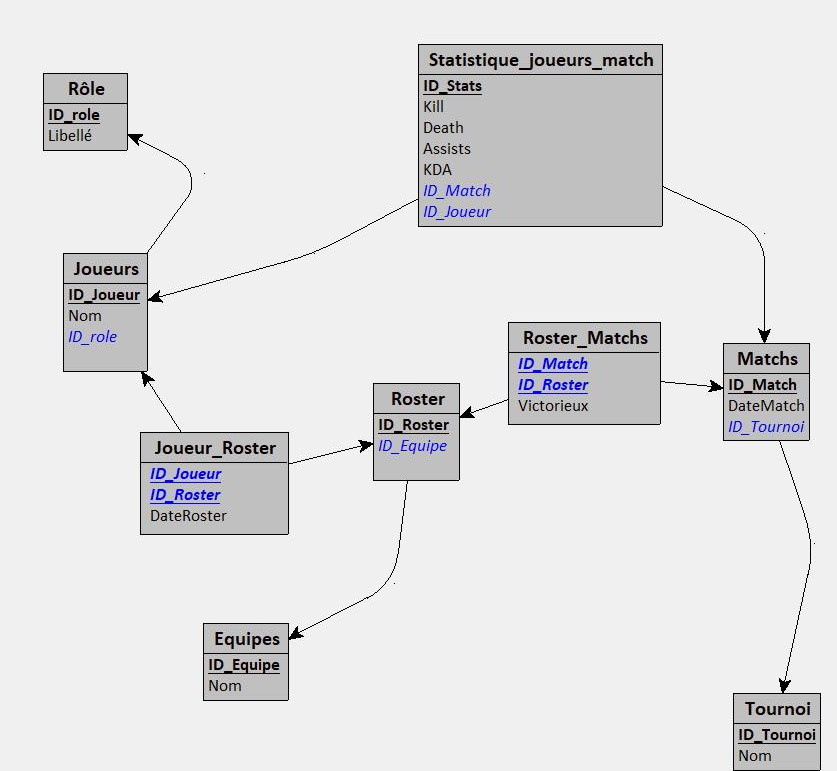

# Qualité Logicielle - Etude du cas Esport
## Annexe 4 : extrait de résultats d’un événement

Le projet a pour but d'afficher les résultats d'un tournoi de League of Legends.

dans le format suivant : 

Pour se faire nous avons réalisé le MLD suivant :

**Mot clés de langage ubiquitaire :**
- **Roster**: l'effectif de l'équipe a une date donné ou un match donné
- **Kill/Deaths/Assists**: Meurtre/Morts/Assistance, représente des statistiques en jeu d'un joueur individuellement
- **Score/KDA**: calcul basé sur les statistiques Kill Deaths Assists.
      La formule est la suivante : **KDA = ( 5 x Kills - 3 * Deaths + 2 * Assists)**

Le détail des tests unitaires est disponible dans le fichier  [suivant](TESTS_UNITAIRES.pdf)